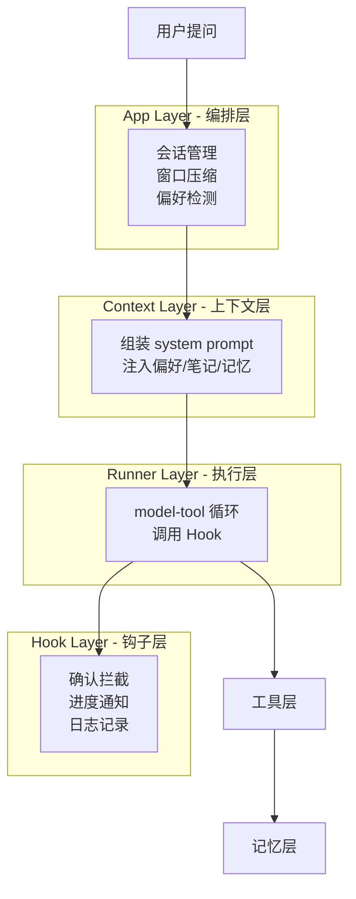
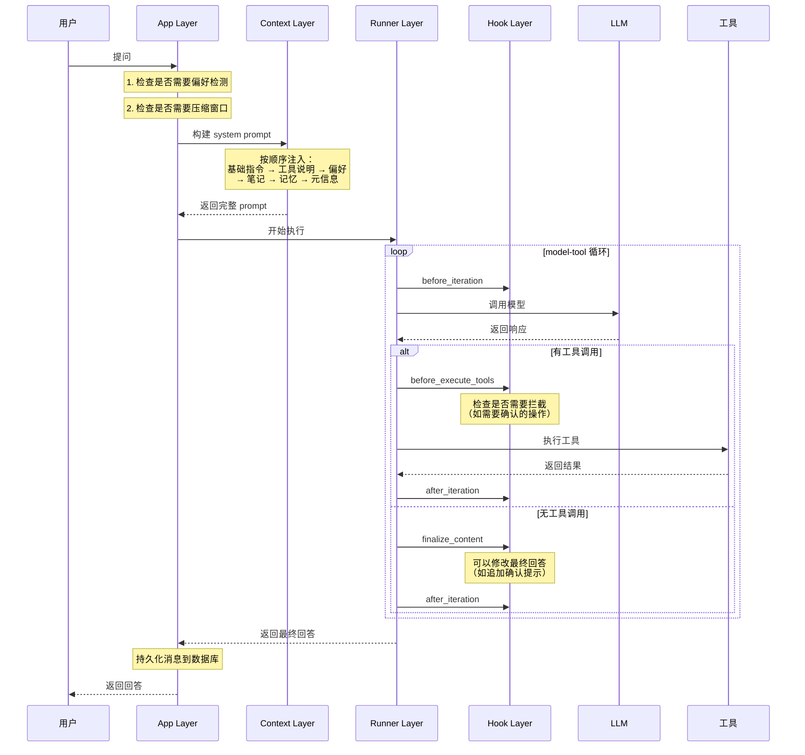
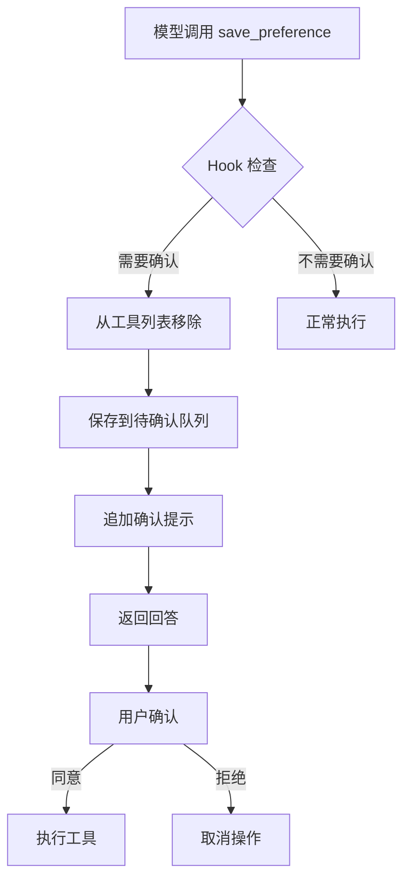
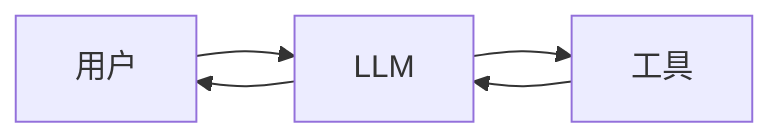
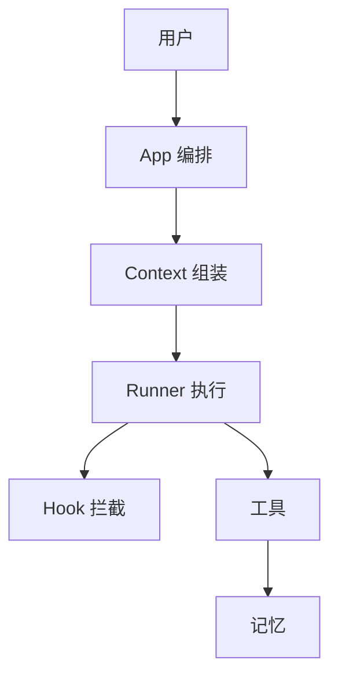

# 系统架构

## 一、核心理念

本项目是基于 **单循环 harness** 架构的论文阅读助手，核心思想是：

> 把"模型直接回答"升级为"可控制、可恢复、可扩展"的执行链路

**关键设计原则**：
1. **职责分层**：编排、组装、执行、拦截各司其职
2. **控制与业务分离**：harness 管控制流，工具层管业务
3. **统一出口**：所有上下文通过一个地方生成
4. **分层恢复**：不同类型的错误分开处理

## 二、四层架构



### 为什么要分四层？

**传统做法**：所有逻辑混在一起
- prompt 拼接散落各处
- 错误处理重复编写
- 难以扩展和维护

**分层后的好处**：
- **App 层**：只管会话生命周期，不管具体怎么回答
- **Context 层**：只管组装上下文，不管怎么执行
- **Runner 层**：只管执行循环，不管业务逻辑
- **Hook 层**：只管拦截和通知，不管核心流程

## 三、执行流程

### 3.1 完整流程



### 3.2 关键节点说明

**节点 1：偏好检测**
- 检查用户输入是否包含长期偏好表达
- 如"以后都用中文回答"
- 命中候选词才调用 fast_llm 判断

**节点 2：窗口压缩**
- 检查消息数量是否超过 20 条
- 超过则把最前面 4 条压缩成摘要
- 摘要存入向量库，原消息删除

**节点 3：上下文组装**
- 按固定顺序注入各类信息
- 保证每次构建的 prompt 结构一致
- 便于调试和优化

**节点 4：Hook 拦截**
- before_execute_tools：可以拦截工具调用
- 如"保存偏好"需要用户确认，就从工具列表中移除
- finalize_content：可以修改最终回答
- 如追加"请确认是否保存"

## 四、各层职责详解

### 4.1 App Layer（编排层）

**核心职责**：管理会话生命周期

**做什么**：
1. 创建或恢复会话
2. 判断是否需要压缩窗口
3. 判断是否需要偏好检测
4. 调用 Context 层构建 prompt
5. 调用 Runner 层执行
6. 持久化消息到数据库

**不做什么**：
- 不直接拼接 prompt
- 不直接调用 LLM
- 不处理工具执行

**设计思路**：
- 只关心"什么时候做什么"
- 不关心"具体怎么做"
- 像一个项目经理，协调各个模块

---

### 4.2 Context Layer（上下文层）

**核心职责**：统一组装 system prompt

**装配顺序**：
```
1. 基础角色指令（你是论文阅读助手）
   ↓
2. 工具说明（你可以使用这些工具）
   ↓
3. Profile 偏好（用户希望用中文回答）
   ↓
4. Study Notes（用户之前记录的笔记）
   ↓
5. Session Memory（历史对话摘要）
   ↓
6. Runtime 元信息（当前会话 ID、已加载文档）
```

**为什么这个顺序**：
- 基础指令最重要，放最前面
- 偏好是长期状态，优先级高于临时记忆
- 笔记是用户主动沉淀，优先级高于自动摘要
- 元信息放最后，用特殊标记包裹

**设计思路**：
- 所有 prompt 从一个出口生成
- 便于调试（只看一个地方）
- 便于优化（统一调整顺序）

---

### 4.3 Runner Layer（执行层）

**核心职责**：纯粹的 model-tool 执行循环

**执行流程**：
```
开始
  ↓
调用 Hook: before_iteration
  ↓
调用 LLM
  ↓
有工具调用？
  ├─ 是 → 调用 Hook: before_execute_tools
  │        ↓
  │      执行工具
  │        ↓
  │      调用 Hook: after_iteration
  │        ↓
  │      继续循环
  │
  └─ 否 → 调用 Hook: finalize_content
           ↓
         调用 Hook: after_iteration
           ↓
         返回最终回答
```

**关键机制**：
1. **迭代上限**：最多 8 轮，避免死循环
2. **输出截断续写**：回答被截断时自动续写
3. **错误重试**：限流和网络错误自动重试

**设计思路**：
- 只管执行，不管业务
- 在关键位置调用 Hook
- 让 Hook 来处理横切关注点

---

### 4.4 Hook Layer（钩子层）

**核心职责**：生命周期拦截

**四个钩子点**：

1. **before_iteration**（迭代开始前）
   - 用途：记录日志、发送进度通知
   - 时机：每轮循环开始

2. **before_execute_tools**（工具执行前）
   - 用途：拦截需要确认的工具
   - 时机：模型返回工具调用后
   - 能力：可以修改工具调用列表

3. **after_iteration**（迭代结束后）
   - 用途：记录统计、清理状态
   - 时机：每轮循环结束

4. **finalize_content**（最终回答生成后）
   - 用途：修改回答内容
   - 时机：无工具调用，准备返回
   - 能力：可以追加确认提示

**设计原则**：
- Hook 只负责拦截和标记
- 不包含业务逻辑
- 不直接执行工具
- 异常不应导致主循环崩溃

**典型应用：确认机制**



## 五、关键设计决策

### 5.1 为什么选择单循环而非多智能体？

**多智能体的问题**：
- 需要 Supervisor 协调
- 增加复杂度
- 难以控制和调试
- 论文阅读场景不需要复杂任务分解

**单循环的优势**：
- 流程清晰，易于理解
- 控制精确，便于调试
- 通过 Hook 保留扩展性
- 符合当前场景需求

---

### 5.2 为什么 Context 层要独立？

**不独立的问题**：
- prompt 拼接散落各处
- 难以调试（不知道最终 prompt 是什么）
- 难以优化（要改多个地方）

**独立后的好处**：
- 统一出口，便于审查
- 便于调试（只看一个地方）
- 便于优化（统一调整顺序和策略）
- 便于 A/B 测试

---

### 5.3 为什么引入 Hook 机制？

**不用 Hook 的问题**：
- 确认逻辑混在 Runner 里
- 日志记录散落各处
- 难以扩展新功能

**用 Hook 的好处**：
- 解耦控制流和业务逻辑
- 支持横切关注点（确认、日志、监控）
- 不破坏 Runner 的纯执行职责
- 便于插拔和组合

---

### 5.4 为什么错误恢复要分层？

**不分层的问题**：
- 模型调用和工具执行的失败模式不同
- 查询类工具和写入类工具的恢复策略不同
- 混在一起难以针对性优化

**分层后的好处**：
- 模型调用：统一处理限流、网络抖动、上下文过长
- 工具执行：区分查询失败和写入失败
- 各自独立优化

## 六、与传统方案对比

### 传统方案（直接调用）



**问题**：
- 所有逻辑混在一起
- 难以控制和调试
- 难以扩展
- 错误处理重复

---

### Harness 方案（分层控制）



**优势**：
- 职责清晰，易于理解
- 控制精确，便于调试
- 易于扩展（加 Hook）
- 错误恢复统一

## 七、实际运行示例

### 场景：用户问"这篇论文讲了什么方法？"

**第 1 步：App 层判断**
- 检查消息数量：15 条，不需要压缩
- 检查用户输入：没有偏好候选词，跳过偏好检测

**第 2 步：Context 层组装**
- 基础指令：你是论文阅读助手
- 工具说明：你可以使用 search_pdf、recall_memory 等工具
- Profile：用户偏好用中文回答
- Study Notes：召回 2 条相关笔记
- Session Memory：召回 3 条历史摘要
- Runtime：当前会话 ID、已加载 paper1.pdf

**第 3 步：Runner 层执行**

*迭代 1*：
- Hook: before_iteration
- 调用 LLM
- LLM 返回：调用 search_pdf 工具
- Hook: before_execute_tools（检查，不需要拦截）
- 执行 search_pdf
- Hook: after_iteration

*迭代 2*：
- Hook: before_iteration
- 调用 LLM（带上工具结果）
- LLM 返回：最终回答
- Hook: finalize_content（检查，不需要修改）
- Hook: after_iteration

**第 4 步：App 层收尾**
- 持久化消息到数据库
- 返回回答给用户

---

### 场景：用户说"以后都用中文回答"

**第 1 步：App 层判断**
- 检查用户输入：命中"以后"候选词
- 调用 fast_llm 判断：是长期偏好，置信度 medium

**第 2 步：Hook 拦截**
- 模型调用 save_preference 工具
- Hook 检查：需要确认
- 从工具列表移除
- 保存到待确认队列

**第 3 步：追加确认提示**
- Hook: finalize_content
- 在回答末尾追加："待确认操作：保存长期偏好 global/language=中文"

**第 4 步：用户确认**
- 用户点击"同意"
- App 层执行待确认动作
- 更新 Profile 状态文件

## 八、总结

**核心价值**：
1. **可控制**：每个环节都可以精确控制
2. **可恢复**：错误分层处理，支持降级
3. **可扩展**：通过 Hook 扩展功能
4. **可维护**：职责清晰，易于理解

**设计哲学**：
- 先把骨架搭出来
- 再把骨架做稳
- 不追求复杂，追求清晰
