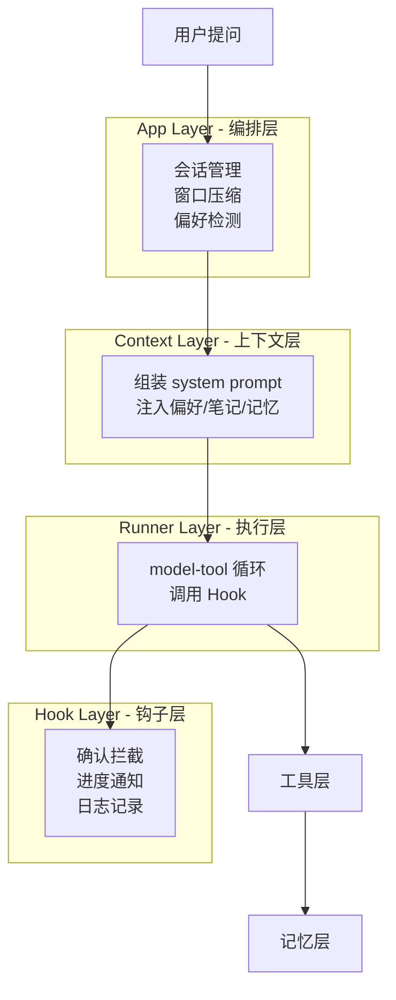
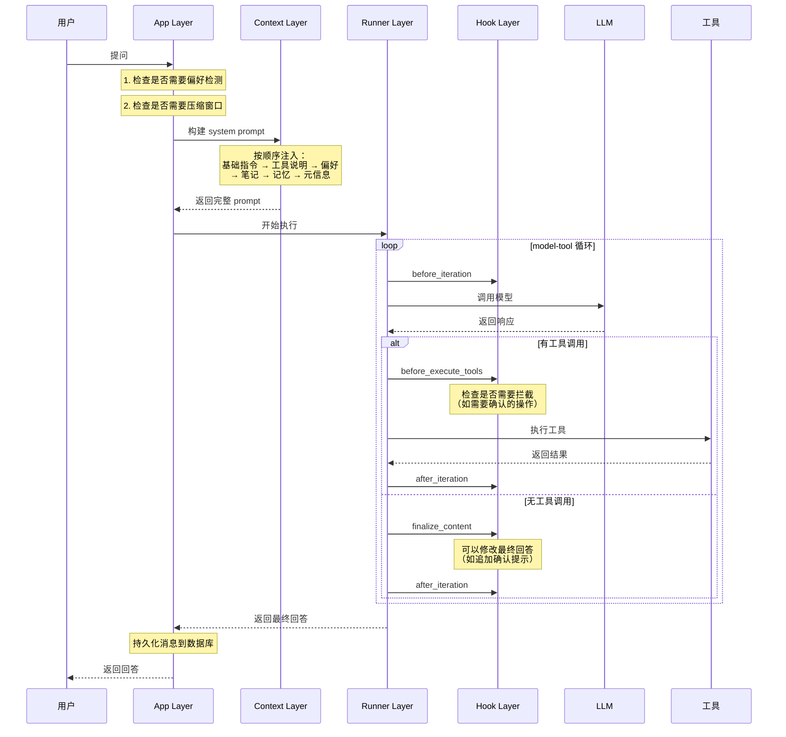
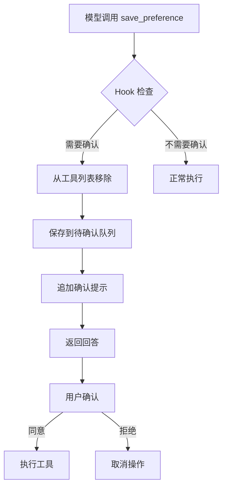
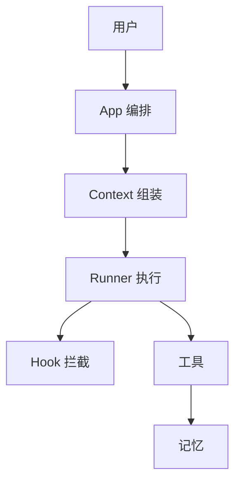

# 系统架构

## 一、核心理念

本项目是基于 **单循环 harness** 架构的论文阅读助手，核心思想是：

> 把"模型直接回答"升级为"可控制、可恢复、可扩展"的执行链路

**关键设计原则**：

1. **职责分层**：编排、组装、执行、拦截各司其职
2. **控制与业务分离**：harness 管控制流，工具层管业务
3. **统一出口**：所有上下文通过一个地方生成
4. **分层恢复**：不同类型的错误分开处理

​	这个项目是一个面向学术论文的 RAG 知识库问答系统。我独立设计并实现的，核心场景是用户上传 PDF
  论文后，用自然语言提问，系统自动检索相关论文片段并生成准确回答。

架构上，我把它设计成一个**单循环编排底座（Harness）**的模式。最外层是一个编排器，它不直接调用模型，而是负责管理整个
  对话的上下文生命周期——包括什么时候压缩历史消息、什么时候写入持久化存储、什么时候触发记忆检索。每次用户提问进来，编排器
  先把本轮该做的事情准备好：从三层记忆里召回用户偏好和相关的历史学习笔记、把过长的对话历史按轮次压缩、组装出一个完整的系
  统提示词。然后它把控制权交给内层的执行器。

执行器是一个标准的模型-工具循环。模型拿到提示词后决定要不要调用工具——比如检索知识库、保存笔记、新增待办——工具执行完
  把结果返回给模型，模型再判断是继续调工具还是直接生成最终回答。这个循环有最大次数限制，防止模型无限调用工具。执行完以后
  ，控制权回到编排器，编排器把本轮的消息写入数据库，再次压缩对话窗口，保存会话状态。

所以整个 Harness的核心思想是外层管状态和生命周期，内层管模型推理和工具调用，两层各司其职。外层不关心模型具体调了哪个工具，内层不关心消息怎么存储、记忆怎么检索。这种分离让两边都可以独立演进——比如我可以单独升级检索管线或者替换模型，而不会影响编排逻辑。

检索这部分我做了混合管线：用户查询先进来做一个查询扩展，然后向量检索和 BM25 关键词检索并行跑，两边结果用 RRF
  融合后重排序。分块策略上用了父子块——大块保证语义完整，小块提高检索精度，检索召回小块后向上聚合成父块返回给模型。工程上还做了几件事：流式输出用后台线程加队列实现，避免阻塞；Provider 层封装了所有模型调用的重试和异常分类；工具调用
  有分级错误恢复——只读工具失败可以自动重试，写入工具失败就硬停止不走后续的循环，重排序失败会降级到融合阶段的结果。

目前用 Ragas 做了基线评测，后续打算加多轮对话支持和更细粒度的引用标注。

AgentLoop：ask(user_message)                                   │
  │                                                      │
  │  ── 准备 ──                                          │
  │  ① 记录用户消息（首轮顺带生成标题）                     │
  │  ② start_turn() 重置本轮确认标记                       │
  │  ③ 清理过期 todo                                      │
  │  ④ 窗口压缩（把旧消息压成摘要，为这轮腾空间）             │
  │  ⑤ save_session() 保底落盘                            │
  │  ⑥ build_system_prompt() 拼好系统提示                  │
  │                                                      │
  │  ── 执行 ──                                          │
  │  ⑦ runner.run(system_prompt, turn_messages)           │
  │     → 模型推理 → 工具调用 → 模型再推理 → ...           │
  │                                                      │
  │  ── 收尾 ──                                          │
  │  ⑧ commit_turn_messages() 筛选非 hidden 消息写入 session│
  │  ⑨ 窗口压缩（再压一次，为下一轮准备）                    │
  │  ⑩ save_session() 最终落盘 

prompt内容：
  │ 1. 基础角色指令（硬编码常量）                 │
  │    "你是专业的学术论文阅读助手..."             │
  │    + 4条工作原则                             │

  │ 2. 工具说明（**动态生成**）                       │
  │    遍历 self.tools，取每个工具 description     │
  │    第一行，拼成列表                          │
  │ 3. 用户长期偏好（全量注入）                    │
  │    preference.build_prompt_block()          │
  │    按 scope → type 固定槽位输出               │
  │ 4. 研究笔记（语义召回，按需注入）               │
  │    search_study_notes() 用 user_message      │
  │    检索，分数≥0.55 的 top-3                  │
  │ 5. 会话记忆（语义召回，按需注入）               │
  │    retrieve_session_memory_entries()         │
  │    在当前 session 范围内检索窗口压缩摘要       │
  │    相似度×0.7 + 新鲜度×0.3 重排序            │
  │ 6. Todo 列表（如果有）                       │
  │    当前 session 的待办任务                    │
  │ 7. 可用 Skill 摘要                          │
  │    skill_loader 扫描 skills/ 目录            │
  │ 8. 运行时元信息（标记为非指令）                │
  │    "[Runtime Context - metadata only]"      │
  │    session_id + 已加载文档名                  │

**provicer层**：

由 Runner 层调用，负责处理底层的 API 调用细节。Runner
  只用调一个函数，拿到统一的 LLMResponse，看里面的 finish_reason 和 tool_calls
  做下一步决策。

  调用过程中，Provider首先尝试执行模型请求。如果抛出异常，根据异常信息的关键字匹配将其归纳为五类：ra
  te_limit（限流）、transient_network（网络抖动）、provider_error（服务端错误）、context_too_long（上下文过长）、unknown（消息格式错误等）。其中前三类是可重试类型，后两类是不可重试类型。可重试的采用指数退避策略，最多重试 3次，等待时间优先使用服务端返回的 Retry-After 头，没有则按 2^(attempt-1)公式计算。不可重试的（包括上下文过长会立刻返回错误供 Runner提示用户缩短问题，未知错误直接返回兜底错误），不再重试。如果 3次重试全部失败，返回最后一次的 error 响应。请求成功返回后，Provider 拿到的是 LangChain的原始返回对象，各字段格式因供应商而异。此时进入归一化处理：先从多层级结构中提取纯文本内容，然后处理工具调用列表——将每个 tool_call 的 args 从有可能是 JSON字符串的格式统一转换为字典，接着从 response_metadata 中提取 finish_reason（取不到就根据有没有 tool_calls 推断），再把 token 用量的字段名从LangChain 风格（input_tokens / output_tokens）统一为内部命名（prompt_tokens /completion_tokens），最后从三个可能的层级查找推理内容（reasoning_content，如DeepSeek R1 的思考过程）。所有字段归一化后组装成内部统一的 LLMResponse 返回给Runner。

 Runner 拿到 LLMResponse，看 finish_reason：

  - stop + 无 tool_calls → 最终回答
  - tool_calls → 执行工具，结果追加到消息列表后继续循环
  - length → 输出被截断，追加"请直接从中断处继续"的指令，最多重复 3 次
  - error + context_too_long → 返回"上下文过长，请尝试缩短问题或开启新会话"
  - error + 其他 → 返回兜底话术"抱歉，当前请求处理失败，请稍后重试"

**错误恢复**：


**PDF解析**：

PDF 入库（load_document）：用 pymupdf4llm 把 PDF 转成
  Markdown，然后两层切分——第一层切成 1500
  字左右的父块（保留完整上下文），第二层在父块内部再切成 400
  字左右的子块（子块间有 50 字重叠）。子块写入 Qdrant 和 BM25
  词法索引。入库后调轻量模型抽取标题和摘要（只读 PDF 前 3000 字），写入
  documents.json。如果模型抽取失败，用文件名当标题、"未能提取摘要"当摘要兜底。

  元数据注册（register_document / is_registered /
  get_all_documents）：documents.json 是一个轻量的文档清单，存了文件名、标题、摘
  要、入库时间、分块数量。list_documents 工具和 SystemContextBuilder
  的"本次已加载文档"都从这读。如果为空但 Qdrant 里有数据，启动时会自动回填。

  父子块的设计考量

  为什么不像 RAG
  常见做法那样只切一种块？因为语义搜索和上下文展示的矛盾：小块检索精度高但缺乏上
  下文，大块上下文完整但语义不够聚焦。当前方案是子块检索、父块返回——400
  字子块用于向量检索和 BM25 打分，命中后聚合到父块（1500
  字）再给模型。这样模型看到的上下文更完整。

**检索效果测试**：

用户问题
-> 查询扩展 / 重写
-> 向量检索 + BM25 检索
-> RRF 融合
-> rerank 重排序
-> 得到若干 context
-> 把 context 给 LLM
-> LLM 生成最终 answer

精确率和召回率基于context计算，然后合并得到F1值。

回答正确性：基于F1值和最终answer与标准答案的相似度的加权和。系统最后说给用户的答案，和标准答案相比，事实是否正确、信息是否完整、语义是否接近。这个指标无法回答问题出在RAG的哪个部分（检索or生成），只看最后的答案是不是像标准答案。

**精确度**：检索出的上下文中，有几条是有用的且有用的内容排在前面。这个指标关心的是把有用信息检索出来且不包含无关信息的能力。比如ai给出的检索结果是4条，且4条中有两个是真的有用信息，那么最后的计算结果是类似第 1 个是相关的：precision@1 = 1/1
第 3 个是相关的：precision@3 = 2/3

context_precision = (1/1 + 2/3) / 相关 context 总数 2
                  = 0.833

**召回率：**把标准答案拆分成若干事实，然后判断这些事实是否出现在召回的文本中。该指标关注的是有没有把答案所需证据检索出来，不太关心无关内容多不多。

**chunk**：每个 parent 大约 1500 字、重叠 200 字；再把每个 parent 切成较小的 child chunk，每个 child 大约 400 字、重叠 50 字。检索时真正进入向量库和 BM25 检索的是 child chunk，因为小块更适合匹配用户 query；但返回给模型时，会通过 metadata 找回对应的 parent chunk，把更完整的上下文交给 LLM。这样做的目的是兼顾“检索精度”和“回答上下文完整性”：小 chunk 负责找得准，大 chunk 负责让模型看得懂上下文。

**如果召回不到答案，可能增大 chunk 或 overlap；如果召回内容太泛、噪声多，可能减小 chunk 或引入标题分段、parent-child、rerank。**

## 二、四层架构



### 为什么要分四层？

**传统做法**：所有逻辑混在一起
- prompt 拼接散落各处
- 错误处理重复编写
- 难以扩展和维护

**分层后的好处**：
- **App 层**：只管会话生命周期，不管具体怎么回答
- **Context 层**：只管组装上下文，不管怎么执行
- **Runner 层**：只管执行循环，不管业务逻辑
- **Hook 层**：只管拦截和通知，不管核心流程

## 三、执行流程

### 3.1 完整流程



### 3.2 关键节点说明

**节点 1：偏好检测**
- 检查用户输入是否包含长期偏好表达
- 如"以后都用中文回答"
- 命中候选词才调用 fast_llm 判断

**节点 2：窗口压缩**
- 检查消息数量是否超过 20 条
- 超过则把最前面 4 条压缩成摘要
- 摘要存入向量库，原消息删除

**节点 3：上下文组装**
- 按固定顺序注入各类信息
- 保证每次构建的 prompt 结构一致
- 便于调试和优化

**节点 4：Hook 拦截**
- before_execute_tools：可以拦截工具调用
- 如"保存偏好"需要用户确认，就从工具列表中移除
- finalize_content：可以修改最终回答
- 如追加"请确认是否保存"

## 四、各层职责详解

### 4.1 App Layer（编排层）

**核心职责**：管理会话生命周期

**做什么**：
1. 创建或恢复会话
2. 判断是否需要压缩窗口
3. 判断是否需要偏好检测
4. 调用 Context 层构建 prompt
5. 调用 Runner 层执行
6. 持久化消息到数据库

**不做什么**：
- 不直接拼接 prompt
- 不直接调用 LLM
- 不处理工具执行

**设计思路**：
- 只关心"什么时候做什么"
- 不关心"具体怎么做"
- 像一个项目经理，协调各个模块

---

### 4.2 Context Layer（上下文层）

**核心职责**：统一组装 system prompt

**装配顺序**：
```
1. 基础角色指令（你是论文阅读助手）
   ↓
2. 工具说明（你可以使用这些工具）
   ↓
3. Profile 偏好（用户希望用中文回答）
   ↓
4. Study Notes（用户之前记录的笔记）
   ↓
5. Session Memory（历史对话摘要）
   ↓
6. Runtime 元信息（当前会话 ID、已加载文档）
```

**为什么这个顺序**：
- 基础指令最重要，放最前面
- 偏好是长期状态，优先级高于临时记忆
- 笔记是用户主动沉淀，优先级高于自动摘要
- 元信息放最后，用特殊标记包裹

**设计思路**：
- 所有 prompt 从一个出口生成
- 便于调试（只看一个地方）
- 便于优化（统一调整顺序）

---

### 4.3 Runner Layer（执行层）

**核心职责**：纯粹的 model-tool 执行循环

**执行流程**：
```
开始
  ↓
调用 Hook: before_iteration
  ↓
调用 LLM
  ↓
有工具调用？
  ├─ 是 → 调用 Hook: before_execute_tools
  │        ↓
  │      执行工具
  │        ↓
  │      调用 Hook: after_iteration
  │        ↓
  │      继续循环
  │
  └─ 否 → 调用 Hook: finalize_content
           ↓
         调用 Hook: after_iteration
           ↓
         返回最终回答
```

**关键机制**：
1. **迭代上限**：最多 8 轮，避免死循环
2. **输出截断续写**：回答被截断时自动续写
3. **错误重试**：限流和网络错误自动重试

**设计思路**：
- 只管执行，不管业务
- 在关键位置调用 Hook
- 让 Hook 来处理横切关注点

---

### 4.4 Hook Layer（钩子层）

**核心职责**：生命周期拦截

**四个钩子点**：

1. **before_iteration**（迭代开始前）
   - 用途：记录日志、发送进度通知
   - 时机：每轮循环开始

2. **before_execute_tools**（工具执行前）
   - 用途：拦截需要确认的工具
   - 时机：模型返回工具调用后
   - 能力：可以修改工具调用列表

3. **after_iteration**（迭代结束后）
   - 用途：记录统计、清理状态
   - 时机：每轮循环结束

4. **finalize_content**（最终回答生成后）
   - 用途：修改回答内容
   - 时机：无工具调用，准备返回
   - 能力：可以追加确认提示

**设计原则**：
- Hook 只负责拦截和标记
- 不包含业务逻辑
- 不直接执行工具
- 异常不应导致主循环崩溃

**典型应用：确认机制**



## 五、关键设计决策

### 5.1 为什么选择单循环而非多智能体？

**多智能体的问题**：
- 需要 Supervisor 协调
- 增加复杂度
- 难以控制和调试
- 论文阅读场景不需要复杂任务分解

**单循环的优势**：
- 流程清晰，易于理解
- 控制精确，便于调试
- 通过 Hook 保留扩展性
- 符合当前场景需求

---

### 5.2 为什么 Context 层要独立？

**不独立的问题**：
- prompt 拼接散落各处
- 难以调试（不知道最终 prompt 是什么）
- 难以优化（要改多个地方）

**独立后的好处**：
- 统一出口，便于审查
- 便于调试（只看一个地方）
- 便于优化（统一调整顺序和策略）
- 便于 A/B 测试

---

### 5.3 为什么引入 Hook 机制？

**不用 Hook 的问题**：
- 确认逻辑混在 Runner 里
- 日志记录散落各处
- 难以扩展新功能

**用 Hook 的好处**：
- 解耦控制流和业务逻辑
- 支持横切关注点（确认、日志、监控）
- 不破坏 Runner 的纯执行职责
- 便于插拔和组合

---

### 5.4 为什么错误恢复要分层？

**不分层的问题**：
- 模型调用和工具执行的失败模式不同
- 查询类工具和写入类工具的恢复策略不同
- 混在一起难以针对性优化

**分层后的好处**：
- 模型调用：统一处理限流、网络抖动、上下文过长
- 工具执行：区分查询失败和写入失败
- 各自独立优化

## 六、与传统方案对比

### 传统方案（直接调用）


**问题**：
- 所有逻辑混在一起
- 难以控制和调试
- 难以扩展
- 错误处理重复

---

### Harness 方案（分层控制）



**优势**：
- 职责清晰，易于理解
- 控制精确，便于调试
- 易于扩展（加 Hook）
- 错误恢复统一

## 七、实际运行示例

### 场景：用户问"这篇论文讲了什么方法？"

**第 1 步：App 层判断**
- 检查消息数量：15 条，不需要压缩
- 检查用户输入：没有偏好候选词，跳过偏好检测

**第 2 步：Context 层组装**
- 基础指令：你是论文阅读助手
- 工具说明：你可以使用 search_pdf、recall_memory 等工具
- Profile：用户偏好用中文回答
- Study Notes：召回 2 条相关笔记
- Session Memory：召回 3 条历史摘要
- Runtime：当前会话 ID、已加载 paper1.pdf

**第 3 步：Runner 层执行**

*迭代 1*：
- Hook: before_iteration
- 调用 LLM
- LLM 返回：调用 search_pdf 工具
- Hook: before_execute_tools（检查，不需要拦截）
- 执行 search_pdf
- Hook: after_iteration

*迭代 2*：
- Hook: before_iteration
- 调用 LLM（带上工具结果）
- LLM 返回：最终回答
- Hook: finalize_content（检查，不需要修改）
- Hook: after_iteration

**第 4 步：App 层收尾**
- 持久化消息到数据库
- 返回回答给用户

---

### 场景：用户说"以后都用中文回答"

**第 1 步：App 层判断**
- 检查用户输入：命中"以后"候选词
- 调用 fast_llm 判断：是长期偏好，置信度 medium

**第 2 步：Hook 拦截**
- 模型调用 save_preference 工具
- Hook 检查：需要确认
- 从工具列表移除
- 保存到待确认队列

**第 3 步：追加确认提示**
- Hook: finalize_content
- 在回答末尾追加："待确认操作：保存长期偏好 global/language=中文"

**第 4 步：用户确认**
- 用户点击"同意"
- App 层执行待确认动作
- 更新 Profile 状态文件

## 八、总结

**核心价值**：
1. **可控制**：每个环节都可以精确控制
2. **可恢复**：错误分层处理，支持降级
3. **可扩展**：通过 Hook 扩展功能
4. **可维护**：职责清晰，易于理解

**设计哲学**：
- 先把骨架搭出来
- 再把骨架做稳
- 不追求复杂，追求清晰
