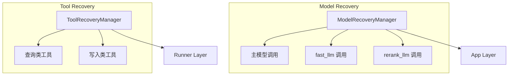
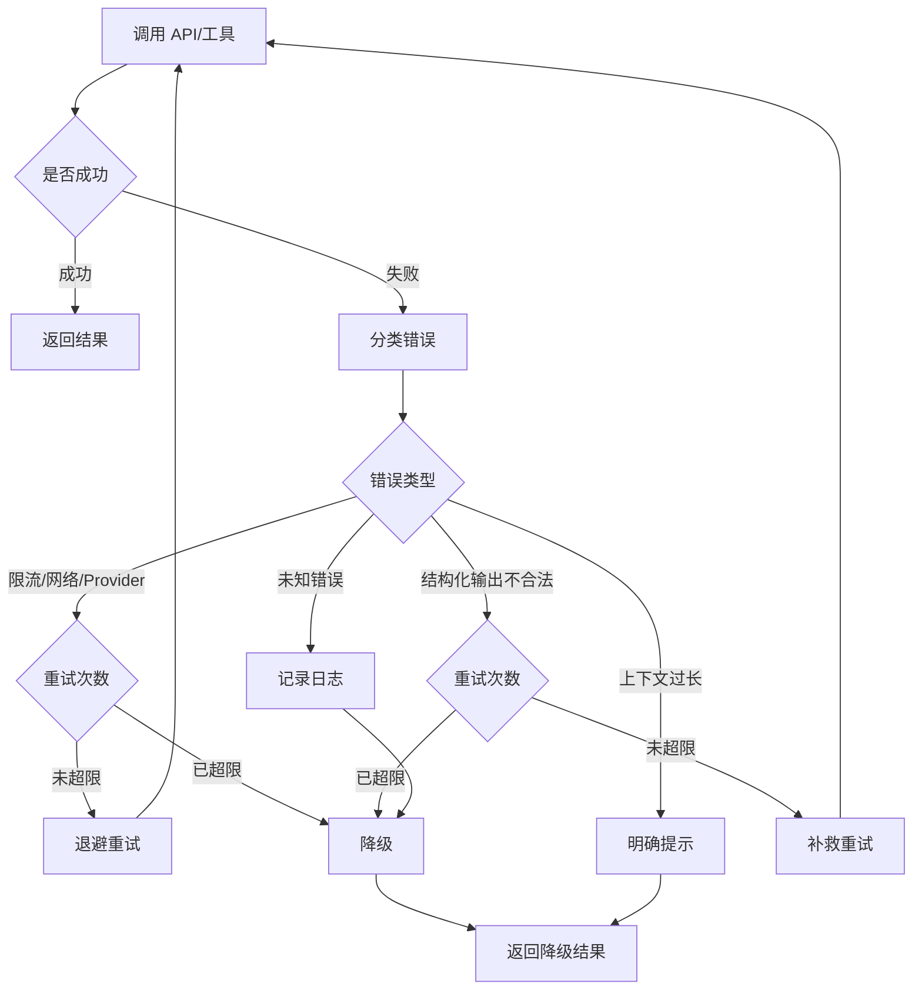

# 错误恢复机制

## 一、设计目标

错误恢复层的目标不是"吞掉所有错误"，而是统一回答四个问题：

1. 这次失败属于什么类型
2. 这个失败能不能重试
3. 连续失败后应该怎么降级
4. 这次失败是否应该中断当前流程

**核心理念**：把错误处理从业务细节里抽出来，变成可解释、可复用的控制面能力

## 二、分层职责



### 2.1 ModelRecoveryManager

**职责**：处理模型与接口调用错误

**覆盖场景**：
- 主模型调用失败
- fast_llm 调用失败（MQE、压缩、偏好检测）
- rerank_llm 调用失败

### 2.2 ToolRecoveryManager

**职责**：处理工具执行错误

**覆盖场景**：
- 查询类工具失败（检索、召回）
- 写入类工具失败（保存、更新、删除）

## 三、错误分类

### 3.1 API 调用错误分类

```python
class ErrorType(Enum):
    RATE_LIMIT = "rate_limit"                    # 限流
    TRANSIENT_NETWORK = "transient_network"      # 网络抖动
    CONTEXT_TOO_LONG = "context_too_long"        # 上下文过长
    STRUCTURED_OUTPUT_INVALID = "structured_output_invalid"  # 结构化输出不合法
    PROVIDER_ERROR = "provider_error"            # Provider 临时错误
    UNKNOWN = "unknown"                          # 未知错误
```

### 3.2 错误分类逻辑

```python
def classify_error(exception: Exception) -> ErrorType:
    error_msg = str(exception).lower()
    
    # 限流
    if "rate limit" in error_msg or "429" in error_msg:
        return ErrorType.RATE_LIMIT
    
    # 上下文过长
    if "context length" in error_msg or "too long" in error_msg:
        return ErrorType.CONTEXT_TOO_LONG
    
    # 网络抖动
    if "timeout" in error_msg or "connection" in error_msg:
        return ErrorType.TRANSIENT_NETWORK
    
    # 结构化输出不合法
    if isinstance(exception, ValidationError):
        return ErrorType.STRUCTURED_OUTPUT_INVALID
    
    # Provider 错误
    if "provider" in error_msg or "service" in error_msg:
        return ErrorType.PROVIDER_ERROR
    
    return ErrorType.UNKNOWN
```

## 四、恢复策略

### 4.1 限流 / 网络抖动 / Provider 临时错误

**策略**：退避重试

```python
def invoke_with_retry(func, max_retries=3):
    for attempt in range(max_retries):
        try:
            return func()
        except Exception as e:
            error_type = classify_error(e)
            
            if error_type in {ErrorType.RATE_LIMIT, ErrorType.TRANSIENT_NETWORK, ErrorType.PROVIDER_ERROR}:
                if attempt < max_retries - 1:
                    wait_time = 2 ** attempt  # 指数退避
                    time.sleep(wait_time)
                    continue
            
            # 其他错误或重试次数用尽
            raise
```

**退避策略**：
- 第 1 次重试：等待 1 秒
- 第 2 次重试：等待 2 秒
- 第 3 次重试：等待 4 秒

### 4.2 上下文过长

**策略**：不重试，直接降级

```python
def handle_context_too_long():
    return {
        "ok": False,
        "message": "上下文过长，请尝试：\n1. 缩短问题\n2. 清理历史消息\n3. 减少文档数量",
        "content": None,
    }
```

**为什么不重试**：
- 重试也会失败
- 需要用户主动调整输入

### 4.3 结构化输出不合法

**策略**：最多补救一次

```python
def invoke_structured_output(func, max_retries=1):
    for attempt in range(max_retries + 1):
        try:
            return func()
        except ValidationError as e:
            if attempt < max_retries:
                # 补救：提示模型输出格式
                prompt = f"上次输出格式不正确：{e}。请严格按照 JSON schema 输出。"
                continue
            
            # 补救失败，降级
            return fallback_result()
```

### 4.4 未知错误

**策略**：不盲目重试，直接降级

```python
def handle_unknown_error(exception: Exception):
    logger.error(f"Unknown error: {exception}")
    return {
        "ok": False,
        "message": "系统错误，请稍后重试",
        "content": None,
    }
```

## 五、分场景降级策略

### 5.1 主模型失败

**场景**：主模型调用失败

**降级策略**：
- 上下文过长：返回明确提示
- 其他错误：返回统一失败回复

```python
def handle_main_model_failure(error_type: ErrorType):
    if error_type == ErrorType.CONTEXT_TOO_LONG:
        return "上下文过长，请尝试缩短问题或清理历史消息。"
    else:
        return "抱歉，当前请求处理失败，请稍后重试。"
```

### 5.2 会话压缩失败

**场景**：fast_llm 压缩失败

**降级策略**：保留对话前部作为摘要兜底

```python
def compress_with_fallback(messages):
    try:
        summary = fast_llm.invoke(messages)
    except Exception:
        # 兜底：直接拼接前部对话
        summary = "\n".join([msg["content"] for msg in messages])
    
    return summary
```

**为什么这样兜底**：
- 不删除原窗口语义
- 保证系统继续运行
- 降级后仍有部分上下文

### 5.3 偏好检测失败

**场景**：fast_llm 偏好检测失败

**降级策略**：本轮不保存偏好，继续正常回答

```python
def detect_preference_with_fallback(user_input):
    try:
        result = fast_llm.with_structured_output(PreferenceDetectionResult).invoke(user_input)
        return result
    except Exception:
        # 兜底：跳过偏好检测
        return None
```

**为什么这样兜底**：
- 偏好检测是辅助链路
- 失败不应影响主回答
- 用户可以下次再表达偏好

### 5.4 文档元数据抽取失败

**场景**：fast_llm 抽取元数据失败

**降级策略**：回退到"文件名 + 默认摘要"

```python
def extract_metadata_with_fallback(pdf_path, markdown):
    try:
        metadata = fast_llm.invoke(markdown)
        return metadata
    except Exception:
        # 兜底：使用文件名和默认摘要
        return {
            "title": Path(pdf_path).stem,
            "summary": "文档摘要抽取失败，请手动查看内容。",
        }
```

### 5.5 MQE 失败

**场景**：fast_llm MQE 扩展失败

**降级策略**：直接使用原始 query

```python
def expand_query_with_fallback(query):
    try:
        expanded = fast_llm.invoke(query)
        return [query] + expanded
    except Exception:
        # 兜底：使用原始 query
        return [query]
```

### 5.6 Rerank 失败

**场景**：rerank_llm 重排失败

**降级策略**：直接回退到 RRF 融合结果

```python
def rerank_with_fallback(query, parents):
    try:
        ranked = rerank_llm.invoke(query, parents)
        return ranked
    except Exception:
        # 兜底：保持 RRF 顺序
        return parents
```

## 六、工具执行错误恢复

### 6.1 查询类工具

**特点**：
- 失败后不中断整轮对话
- 优先降级，把失败信息暴露给模型
- 区分"没查到内容"和"工具执行失败"

**实现**：
```python
def invoke_read_tool(tool_name, tool_impl, tool_args):
    try:
        result = tool_impl.invoke(tool_args)
        
        # 区分"没查到"和"执行失败"
        if not result or result == "未找到相关内容":
            return ToolResult(
                ok=True,
                content="未找到相关内容",
                message="",
            )
        
        return ToolResult(
            ok=True,
            content=result,
            message="",
        )
    
    except Exception as e:
        logger.error(f"Tool {tool_name} failed: {e}")
        return ToolResult(
            ok=False,
            content="",
            message=f"工具执行失败：{str(e)}",
        )
```

**查询类工具列表**：
- `list_documents`
- `search_pdf`
- `recall_memory`
- `list_notes`
- `search_notes`
- `get_stats`

### 6.2 写入类工具

**特点**：
- 更保守，不轻易自动重试
- 先保证幂等性或原子性
- 失败后明确告知用户

**实现**：
```python
def invoke_write_tool(tool_name, tool_impl, tool_args):
    try:
        result = tool_impl.invoke(tool_args)
        return ToolResult(
            ok=True,
            content=result,
            message="",
        )
    
    except Exception as e:
        logger.error(f"Tool {tool_name} failed: {e}")
        return ToolResult(
            ok=False,
            content="",
            message=f"操作失败：{str(e)}。请检查后重试。",
        )
```

**写入类工具列表**：
- `save_note`
- `update_note`
- `delete_note`

### 6.3 工具结果结构

```python
@dataclass
class ToolResult:
    ok: bool           # 是否成功
    content: str       # 工具返回内容
    message: str       # 错误信息或提示
```

## 七、错误恢复流程



## 八、实施顺序

错误恢复按下面顺序推进：

1. **先统一模型与接口调用错误恢复**
   - API 调用是横切层，最容易收口
   - 主模型、fast_llm、rerank_llm 共用同一套分类和重试逻辑

2. **再做工具执行错误恢复**
   - 工具层需要先把读操作和写操作分开
   - 不同工具的降级策略不同

3. **最后再补 checkpoint / 中断恢复**
   - 需要前两层稳定后再做
   - 涉及状态持久化和恢复

## 九、设计权衡

### 9.1 为什么不吞掉所有错误

**优点**：
- 明确告知用户失败原因
- 便于排查问题
- 避免静默失败

**缺点**：
- 用户体验可能不如自动恢复

**当前取舍**：正确性和可调试性优先

### 9.2 为什么查询类工具和写入类工具分开

**优点**：
- 查询失败影响小，可以降级
- 写入失败影响大，需要明确告知
- 策略分离，便于优化

**缺点**：
- 需要维护两套恢复逻辑

**当前取舍**：安全性优先

### 9.3 为什么主模型和辅助模型降级策略不同

**优点**：
- 主模型是主链路，失败应该明确
- 辅助模型是辅助链路，失败可以降级
- 符合业务语义

**缺点**：
- 需要区分主模型和辅助模型

**当前取舍**：业务语义优先

## 十、后续优化方向

1. **更细粒度的错误分类**：区分更多错误类型
2. **动态重试策略**：根据错误类型动态调整重试次数
3. **熔断机制**：连续失败后暂停调用
4. **降级策略配置化**：支持通过配置文件调整降级策略
5. **Checkpoint / 中断恢复**：支持长任务中断后恢复
