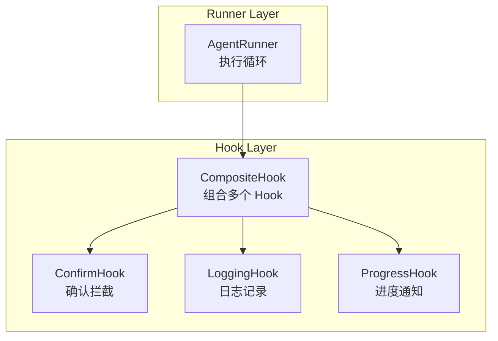
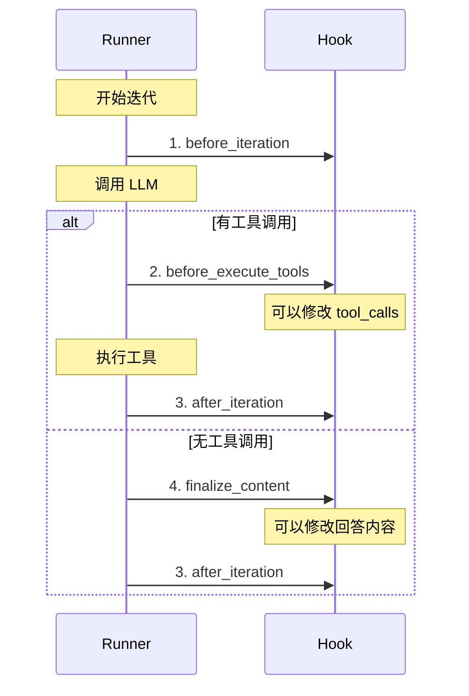
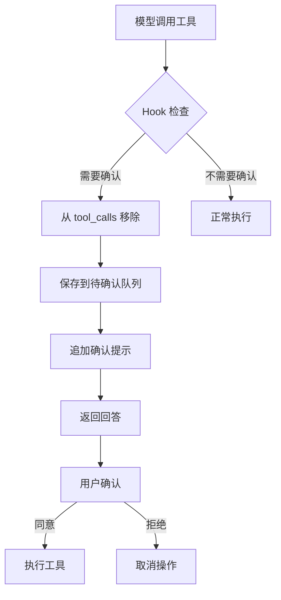
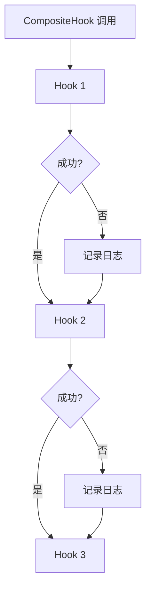
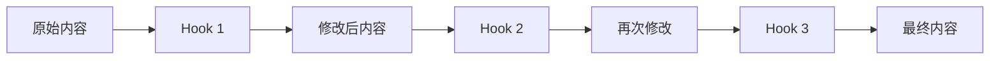
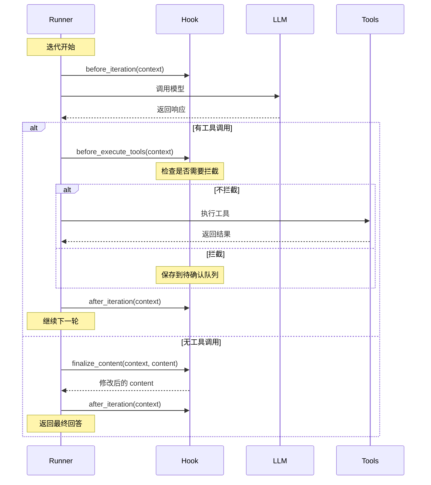

# Hook 机制

## 一、设计目标

Hook 机制提供生命周期拦截能力，解决横切关注点：

1. **确认机制**：拦截需要用户确认的操作
2. **进度通知**：在关键节点通知外部
3. **日志记录**：统一记录执行过程
4. **内容过滤**：修改最终回答

**设计原则**（参考 nanobot）：
- Hook 只负责拦截和标记
- 不包含业务逻辑
- 不直接执行工具
- 异常不应导致主循环崩溃

## 二、Hook 架构



### 核心组件

**HookContext**：单轮执行上下文
- iteration：当前迭代次数
- messages：消息历史
- tool_calls：工具调用列表
- tool_results：工具执行结果
- final_content：最终回答

**Hook**：基础 Hook 类
- 定义 4 个钩子点
- 子类继承并实现

**CompositeHook**：组合多个 Hook
- 按顺序执行
- 支持错误隔离

## 三、四个钩子点



### 3.1 before_iteration

**调用时机**：每轮迭代开始前

**典型用途**：
- 记录迭代开始
- 初始化本轮状态
- 发送进度通知

**示例场景**：
```
迭代 1 开始
迭代 2 开始
迭代 3 开始
```

---

### 3.2 before_execute_tools

**调用时机**：工具执行前

**典型用途**：
- 记录工具调用日志
- **拦截需要确认的工具**
- 设置工具执行上下文

**关键能力**：可以修改 `context.tool_calls`

**示例场景**：
```
模型调用：save_preference
Hook 检查：需要确认
从 tool_calls 移除
保存到待确认队列
```

---

### 3.3 after_iteration

**调用时机**：每轮迭代结束后

**典型用途**：
- 记录 Token 使用统计
- 清理本轮状态
- 发送迭代完成通知

**示例场景**：
```
迭代 1 结束，Token 使用：prompt=1000, completion=200
迭代 2 结束，Token 使用：prompt=1200, completion=150
```

---

### 3.4 finalize_content

**调用时机**：最终回答生成后

**典型用途**：
- 过滤思考标签
- **追加确认提示**
- 格式化输出

**关键特性**：管道式调用

**示例场景**：
```
原始回答："论文使用了 BERT 模型"
Hook 1 过滤：去除 <think> 标签
Hook 2 追加："待确认：保存长期偏好"
最终回答："论文使用了 BERT 模型\n\n待确认：保存长期偏好"
```

## 四、ConfirmHook 实现

### 4.1 设计思路

**目标**：拦截需要用户确认的工具调用

**流程**：


### 4.2 判断逻辑

**需要确认的工具**：
- `save_preference`：保存长期偏好
- `save_todo`：保存待办事项
- 其他写入类工具（可配置）

**判断依据**：
- 工具名称
- 置信度（medium 需要确认）
- 操作类型（delete、clear 需要确认）

### 4.3 确认提示格式

**单个操作**：
```
待确认操作：
- 保存长期偏好：global / language = 中文

请回复"同意"或"拒绝"。
```

**多个操作**：
```
待确认操作：
1. 保存长期偏好：global / language = 中文
2. 保存会话 todo：阅读论文方法部分

请回复"同意"或"拒绝"。
```

## 五、CompositeHook 错误隔离

### 5.1 异常隔离机制



**设计原则**：
- 单个 Hook 失败不影响其他 Hook
- 单个 Hook 失败不导致主循环崩溃
- 记录异常日志便于排查

### 5.2 finalize_content 不做隔离

**为什么**：
- 管道式调用
- 每个 Hook 的输出作为下一个的输入
- 异常应该暴露出来

**流程**：


## 六、Hook 调用流程

### 6.1 完整流程



### 6.2 关键时刻

**时刻 1：迭代开始**
- 记录日志："开始第 N 轮迭代"
- 初始化状态

**时刻 2：工具执行前**
- 检查工具列表
- 拦截需要确认的工具
- 记录工具调用日志

**时刻 3：迭代结束**
- 记录 Token 使用
- 清理本轮状态

**时刻 4：最终回答**
- 过滤特殊标签
- 追加确认提示
- 格式化输出

## 七、实际运行示例

### 场景 1：正常工具调用

**用户**："这篇论文讲了什么？"

**执行流程**：
1. before_iteration：记录"迭代 1 开始"
2. 调用 LLM：返回 search_pdf 工具
3. before_execute_tools：检查，不需要拦截
4. 执行 search_pdf：返回论文内容
5. after_iteration：记录"迭代 1 结束"
6. before_iteration：记录"迭代 2 开始"
7. 调用 LLM：返回最终回答
8. finalize_content：不需要修改
9. after_iteration：记录"迭代 2 结束"

---

### 场景 2：拦截确认

**用户**："以后都用中文回答"

**执行流程**：
1. before_iteration：记录"迭代 1 开始"
2. 调用 LLM：返回 save_preference 工具
3. before_execute_tools：
   - 检查：需要确认
   - 从 tool_calls 移除
   - 保存到待确认队列
4. 工具列表为空，跳过执行
5. after_iteration：记录"迭代 1 结束"
6. before_iteration：记录"迭代 2 开始"
7. 调用 LLM：返回最终回答
8. finalize_content：
   - 追加："待确认：保存长期偏好"
9. after_iteration：记录"迭代 2 结束"

---

### 场景 3：多个 Hook 组合

**配置**：
- ConfirmHook：拦截确认
- LoggingHook：记录日志
- ProgressHook：发送进度

**执行流程**：
1. before_iteration：
   - ConfirmHook：无操作
   - LoggingHook：记录"迭代开始"
   - ProgressHook：发送"正在思考..."
2. before_execute_tools：
   - ConfirmHook：检查是否拦截
   - LoggingHook：记录工具调用
   - ProgressHook：发送"正在执行工具..."
3. after_iteration：
   - ConfirmHook：无操作
   - LoggingHook：记录 Token 使用
   - ProgressHook：发送"迭代完成"

## 八、设计权衡

### 8.1 为什么 Hook 不执行业务逻辑？

**优点**：
- 职责清晰
- 业务逻辑在工具层，便于测试
- Hook 失败不影响核心功能

**缺点**：
- 需要在 App 层处理确认逻辑
- Hook 和 App 之间需要传递状态

**当前取舍**：职责分离优先

---

### 8.2 为什么 finalize_content 不做异常隔离？

**优点**：
- 异常暴露出来，便于调试
- 管道式调用，中间失败应该明确

**缺点**：
- 单个 Hook 失败会导致整个管道失败

**当前取舍**：正确性优先

---

### 8.3 为什么不支持 Hook 优先级？

**当前问题**：
- 按列表顺序执行
- 无法控制优先级

**后续优化**：
- 支持 priority 参数
- 按优先级排序执行

## 九、与 nanobot 的对比

### 9.1 相同点

- 基础 Hook 类定义相同的钩子点
- CompositeHook 组合多个 Hook
- 异常隔离机制
- 上下文传递

### 9.2 差异点

| 特性 | nanobot | 本项目 |
|-----|---------|--------|
| 异步支持 | 全异步 | 同步 |
| 流式输出 | 支持 | 暂不支持 |
| Hook 数量 | 6 个钩子点 | 4 个钩子点 |
| 工具拦截 | 只通知 | 可以修改 tool_calls |

### 9.3 可以借鉴的

1. **reraise 标志**：用于调试时暴露异常
2. **流式支持**：未来可以添加
3. **更细粒度的钩子点**：如 on_stream_end
4. **工具上下文设置**：在 before_execute_tools 中设置权限

## 十、后续优化方向

1. **流式支持**：添加 on_stream 和 on_stream_end 钩子
2. **reraise 标志**：支持调试模式下暴露异常
3. **Hook 优先级**：支持 Hook 执行顺序控制
4. **Hook 配置**：支持通过配置文件启用/禁用 Hook
5. **更多钩子点**：如 before_model_call、after_model_call
