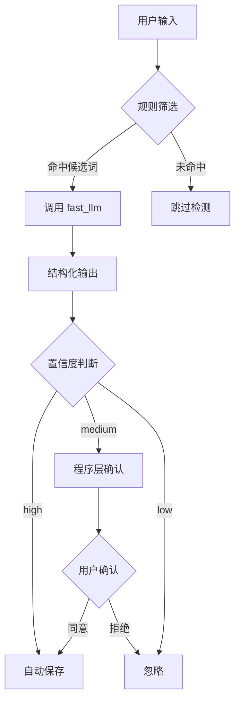
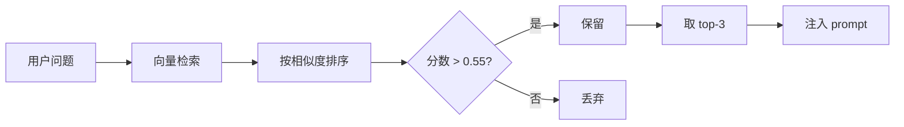
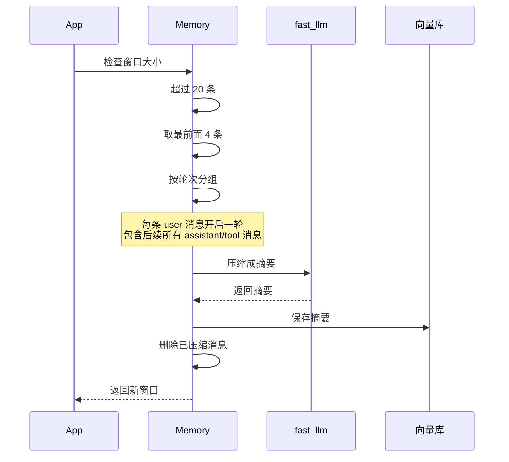
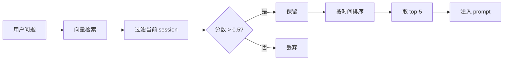
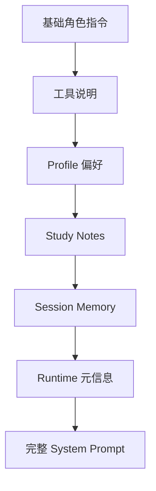
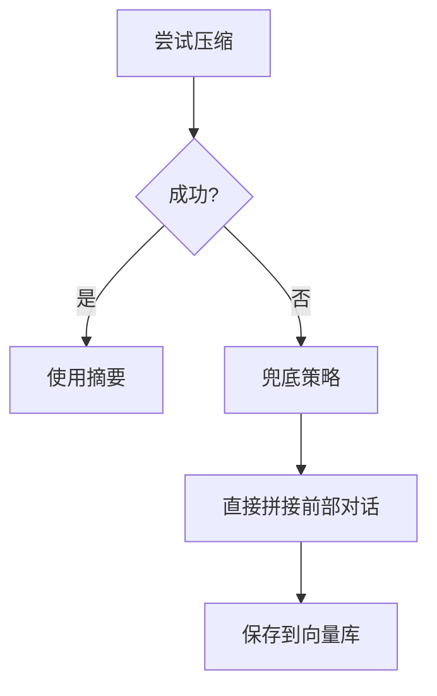
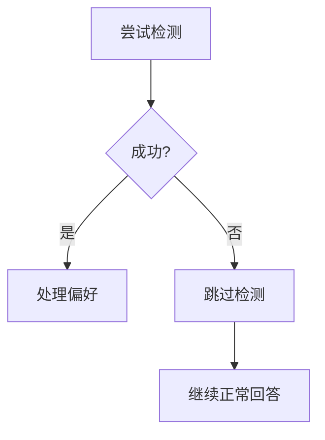

# 记忆系统

## 一、设计目标

记忆系统解决三个核心问题：

1. **长对话续航**：对话超过 20 条后不会断片
2. **跨会话个性化**：用户偏好跨会话继承
3. **研究沉淀**：研究笔记可跨会话复用

## 二、三层记忆架构

```mermaid
graph TB
    subgraph Profile Memory - 长期偏好
        P1[状态文件存储]
        P2[scope + type 槽位]
        P3[每轮全量注入]
    end
    
    subgraph Study Notes - 研究笔记
        S1[独立向量库]
        S2[用户主动保存]
        S3[语义检索召回]
    end
    
    subgraph Session Memory - 会话记忆
        M1[滑动窗口 20条]
        M2[超窗压缩成摘要]
        M3[向量库存储]
    end
    
    Profile Memory --> Prompt[System Prompt]
    Study Notes --> Prompt
    Session Memory --> Prompt
```

### 为什么要三层？

**不分层的问题**：
- 所有记忆混在一起
- 无法区分优先级
- 难以针对性优化

**分层后的好处**：
- Profile：状态机模型，避免冲突偏好
- Study Notes：用户主动沉淀，高价值
- Session Memory：自动压缩，低优先级

## 三、Profile Memory（长期偏好）

### 3.1 核心特点

**不是**：可检索的碎片记忆列表  
**而是**：当前生效的用户偏好状态

**关键机制**：
- 使用状态文件保存当前偏好
- 使用事件日志记录变更历史
- 按 `scope + type` 定位槽位
- 同槽位新值覆盖旧值
- 每轮全量注入，不做检索

### 3.2 支持的偏好类型

**Scope（作用范围）**：
- `global`：全局回答
- `paper_summary`：论文总结
- `paper_compare`：论文对比

**Type（偏好类型）**：
- `language`：语言偏好（中文、英文）
- `format`：输出格式（列表、段落、表格）
- `detail_level`：详细程度（简洁、详细）
- `focus`：重点关注（方法、实验、结论）
- `avoid`：尽量避免（术语、公式）

### 3.3 存储结构

```
data/profiles/{user_id}/
  ├── state.json          # 当前生效的偏好
  └── events.jsonl        # 变更历史
```

**state.json 示例**：
```
{
  "global": {
    "language": "中文",
    "format": "分点列出"
  },
  "paper_summary": {
    "focus": "方法和实验结果"
  }
}
```

### 3.4 偏好检测流程



**规则筛选候选词**：
- "以后"、"之后"、"默认"、"每次"
- "我更喜欢"、"我希望"、"请记住"
- "不要再"、"后面都按这个来"

**为什么不是每轮都调用 fast_llm**：
- 避免普通问答也触发检测
- 降低 API 调用成本
- 规则筛选已经能覆盖大部分场景

### 3.5 为什么不做检索型记忆？

**检索型的问题**：
- 可能召回冲突偏好（"用中文" vs "用英文"）
- 需要打分和过滤，增加复杂度
- 偏好数量少，全量注入成本低

**状态机的优势**：
- 同槽位只有一个值，不会冲突
- 语义清晰，符合偏好的本质
- 实现简单，易于维护

## 四、Study Notes（研究笔记）

### 4.1 核心特点

**职责**：保存用户主动沉淀的研究信息

**特点**：
- 独立向量库（`study_notes` collection）
- 支持 CRUD 操作
- 语义检索召回
- 分数阈值过滤（0.55）
- 每轮最多召回 3 条

### 4.2 存储结构

**向量库元数据**：
- user_id：用户标识
- note_id：笔记 ID
- title：笔记标题
- content：笔记内容
- created_at：创建时间
- updated_at：更新时间

### 4.3 召回策略



**为什么阈值是 0.55**：
- 比 session memory（0.5）更严格
- 避免无关笔记注入
- 保证召回质量

### 4.4 为什么独立 collection？

**不独立的问题**：
- 和 session summary 混在一起
- 召回策略无法独立优化
- 难以管理和维护

**独立后的好处**：
- 职责清晰
- 召回策略独立
- 支持显式 CRUD

## 五、Session Memory（会话记忆）

### 5.1 核心特点

**职责**：支持长对话续航

**机制**：
- 最近 20 条消息保留在窗口
- 超过 20 条时压缩最前面 4 条
- 压缩成摘要存入向量库
- 按需召回相关摘要

### 5.2 窗口压缩流程



### 5.3 为什么按轮次压缩？

**不按轮次的问题**：
- 可能删除 assistant(tool_calls) 但保留 tool 消息
- 导致孤立的 tool 消息
- API 报错：tool 消息前必须有对应的 assistant

**按轮次的好处**：
- 保持消息结构完整
- 避免孤立 tool 消息
- 符合 API 要求

### 5.4 召回策略



**为什么按时间排序**：
- 近期记忆更重要
- 符合人类记忆特点
- 避免过时信息干扰

## 六、上下文注入顺序



### 为什么这个顺序？

1. **基础指令最重要**：定义角色和原则
2. **工具说明紧随其后**：让模型知道有哪些能力
3. **Profile 优先级高**：长期状态优先于临时记忆
4. **Study Notes 次之**：用户主动沉淀优先于自动摘要
5. **Session Memory 最低**：自动压缩，优先级最低
6. **Runtime 元信息最后**：用特殊标记包裹，与指令区分

## 七、压缩失败兜底

### 7.1 压缩失败场景

**可能原因**：
- fast_llm 调用失败
- 网络超时
- API 限流

### 7.2 兜底策略



**为什么这样兜底**：
- 不删除原窗口语义
- 保证系统继续运行
- 降级后仍有部分上下文

## 八、偏好检测失败兜底

### 8.1 失败场景

**可能原因**：
- fast_llm 调用失败
- 输出不合法（不符合 JSON schema）

### 8.2 兜底策略



**为什么这样兜底**：
- 偏好检测是辅助链路
- 失败不应影响主回答
- 用户可以下次再表达偏好

## 九、设计权衡

### 9.1 Profile 为什么不做检索？

**优点**：
- 避免冲突偏好
- 全量注入成本低
- 状态机模型清晰

**缺点**：
- 不支持复杂偏好表达
- 不支持条件偏好

**当前取舍**：优先简单稳定

---

### 9.2 Study Notes 为什么独立？

**优点**：
- 职责清晰
- 召回策略独立
- 支持显式 CRUD

**缺点**：
- 增加一个 collection
- 迁移旧数据有成本

**当前取舍**：职责分离优先

---

### 9.3 为什么窗口大小是 20？

**太小的问题**：
- 频繁压缩
- 增加 API 调用

**太大的问题**：
- 占用 prompt 空间
- 影响回答质量

**当前取舍**：20 条是经验值，可根据实际调整

## 十、实际运行示例

### 场景 1：首次对话

**用户**："这篇论文讲了什么？"

**记忆注入**：
- Profile：用户偏好用中文回答
- Study Notes：无（还没保存笔记）
- Session Memory：无（首次对话）

---

### 场景 2：长对话

**用户**：第 25 条消息

**触发压缩**：
- 窗口有 24 条消息
- 取最前面 4 条（2 轮对话）
- 压缩成摘要："用户询问了论文的方法部分，助手解释了..."
- 保存到向量库
- 删除原 4 条消息
- 窗口剩余 20 条

---

### 场景 3：跨会话

**用户**：新会话，问"之前那篇论文的方法是什么？"

**记忆注入**：
- Profile：用户偏好用中文回答（跨会话继承）
- Study Notes：召回 2 条相关笔记（跨会话复用）
- Session Memory：无（新会话）

---

### 场景 4：偏好更新

**用户**："以后都用英文回答"

**处理流程**：
1. 规则筛选：命中"以后"
2. fast_llm 判断：是长期偏好，置信度 medium
3. Hook 拦截：需要确认
4. 追加提示："待确认：保存长期偏好 global/language=英文"
5. 用户确认：点击"同意"
6. 更新 state.json：`{"global": {"language": "英文"}}`
7. 追加事件日志

## 十一、后续优化方向

1. **任务门控**：根据问题类型决定是否召回记忆
2. **动态阈值**：根据问题类型调整召回阈值
3. **版本管理**：Profile 支持版本号和回滚
4. **压缩策略优化**：根据内容重要性动态调整
5. **召回策略优化**：结合相似度和时间衰减
