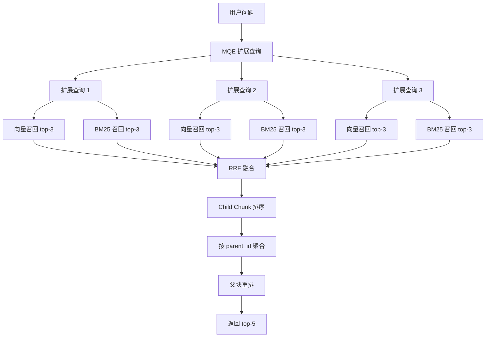
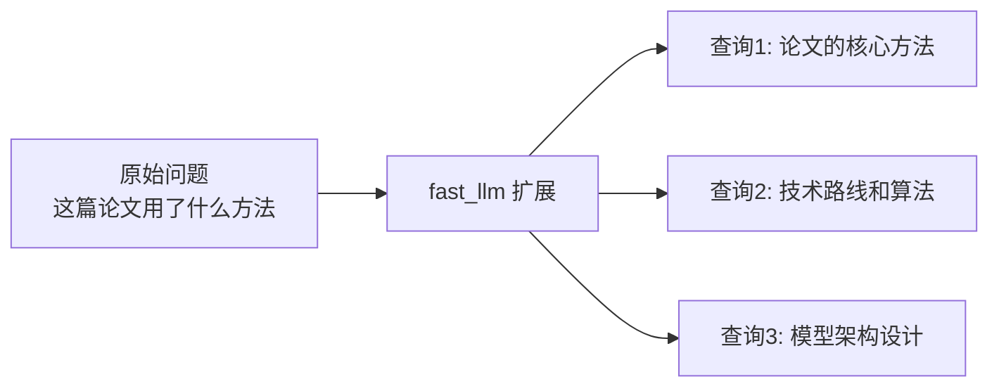
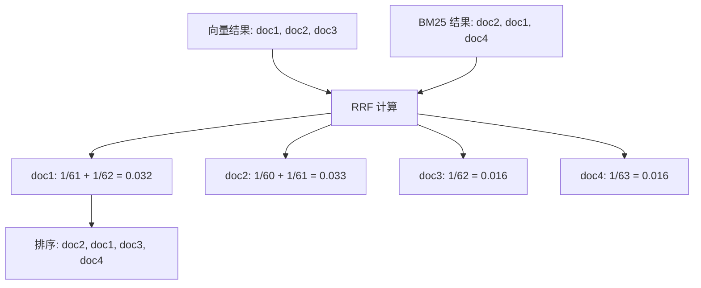
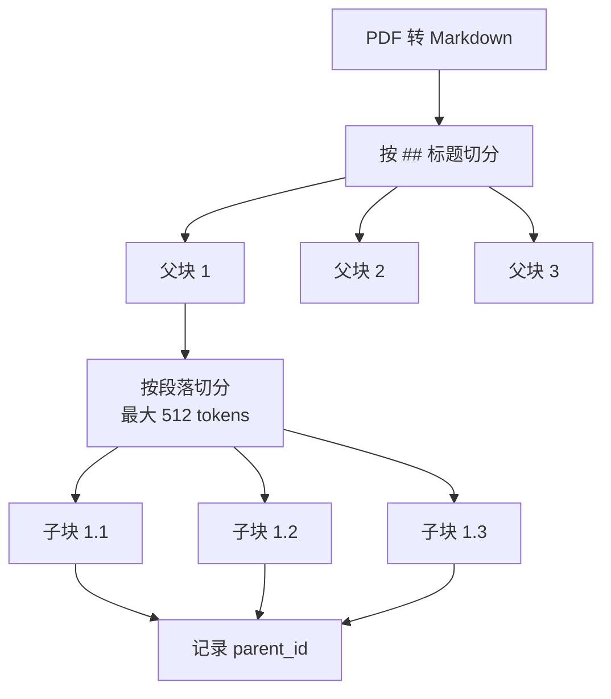
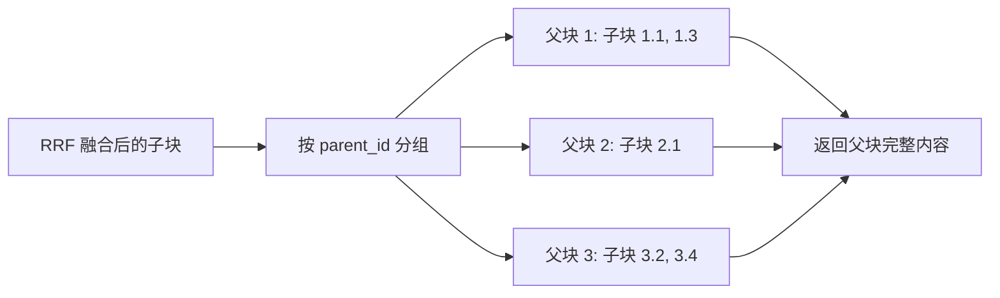
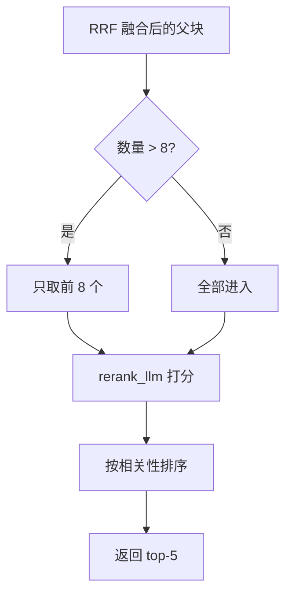
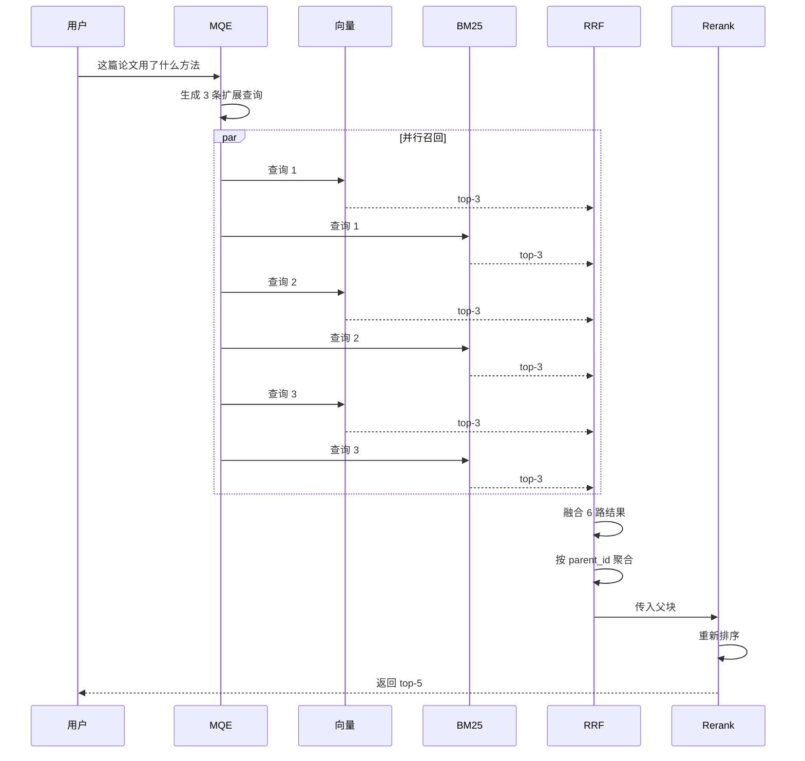
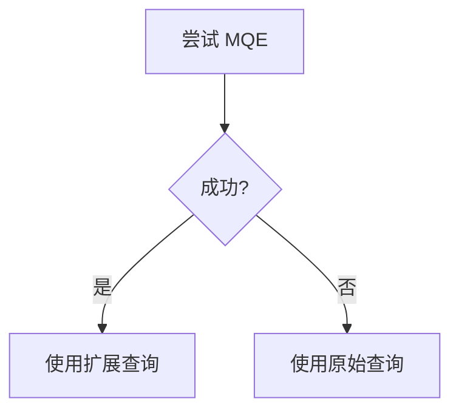
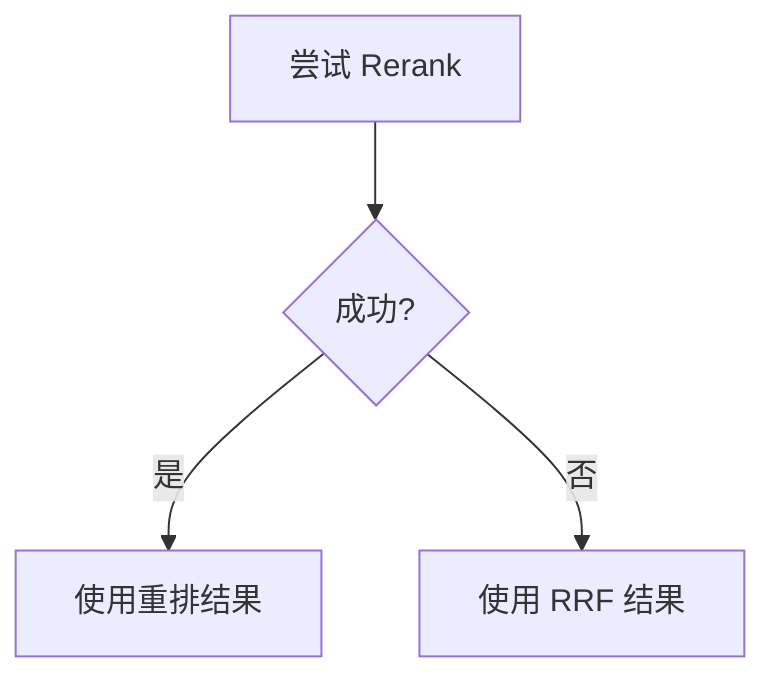
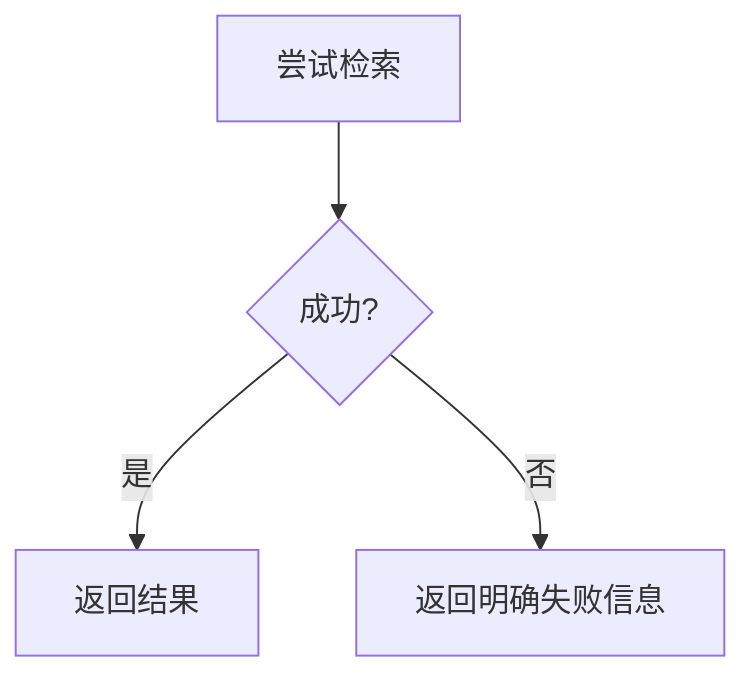

# 混合检索系统

## 一、设计目标

解决论文阅读场景的两类检索需求：

1. **语义召回**：理解"这篇论文用了什么方法"
2. **精确匹配**：准确找到"BERT"、"ImageNet"、"95.6%"

## 二、检索链路



### 为什么这么设计？

**核心思想**：
- 用小块检索（精确）
- 用大块回答（完整）
- 多路召回（全面）
- 重排优化（精准）

## 三、MQE（多查询扩展）

### 3.1 作用

把单个问题扩展成多个相关查询，提高召回率

### 3.2 工作流程



### 3.3 为什么需要 MQE？

**问题场景**：
- 用户问"这篇论文讲了啥"
- 论文里写的是"本文提出了一种新的..."
- 表达不一致，直接检索可能漏掉

**MQE 的作用**：
- 从不同角度表达同一个问题
- 提高召回率
- 覆盖更多可能的表达方式

### 3.4 参数设置

- **扩展数量**：3 条（原问题 + 3 条扩展 = 4 条）
- **最小长度**：4 字（过短不扩展）
- **去重阈值**：0.8（避免简单改写）

## 四、向量检索

### 4.1 工作原理


### 4.2 擅长的场景

- 语义相近的表达
- 同义词和改写
- 跨语言检索
- 概念性问题

### 4.3 不擅长的场景

- 精确关键词（模型名、数据集名）
- 缩写（NLP、CV、RL）
- 数字（2023、100M、95.6%）
- 中英混合关键词

## 五、BM25 词法检索

### 5.1 工作原理


### 5.2 BM25 公式（简化理解）

**核心思想**：
- 词频越高，分数越高（但有上限）
- 文档越短，分数越高（归一化）
- 词越罕见，分数越高（IDF）

**参数**：
- k1 = 1.5：词频饱和参数
- b = 0.75：长度归一化参数

### 5.3 擅长的场景

- 精确关键词匹配
- 模型名（BERT、GPT-3）
- 数据集名（ImageNet、COCO）
- 术语和缩写
- 数字和百分比

### 5.4 为什么持久化索引？

**早期方案**：检索时扫描 Qdrant，现算 BM25

**问题**：
- 每次都要扫描全量数据
- 计算 TF-IDF 开销大
- 检索速度慢

**当前方案**：SQLite 持久化倒排索引

**优势**：
- 文档入库时增量写入
- 检索时直接查询索引
- 速度快，成本低

## 六、RRF 融合

### 6.1 作用

融合多路召回结果，不要求分数在同一尺度

### 6.2 工作原理



### 6.3 RRF 公式

```
RRF(d) = Σ 1 / (k + rank_i(d))

其中：
- rank_i(d)：文档 d 在第 i 路召回中的排名
- k = 60：平滑参数
```

### 6.4 为什么用 RRF？

**加权融合的问题**：
- 向量分数和 BM25 分数不在同一尺度
- 需要归一化，引入额外参数
- 权重难以调优

**RRF 的优势**：
- 只看排名，不看分数
- 不需要归一化
- 实现简单
- 对多路召回融合比较稳

## 七、父子块切分

### 7.1 为什么需要父子块？

**矛盾**：
- 检索需要小块（精确定位）
- 回答需要大块（完整上下文）

**解决方案**：
- 用子块检索
- 用父块回答

### 7.2 切分策略



### 7.3 聚合流程



## 八、Rerank 重排

### 8.1 作用

用独立模型对父块重新排序，提升精确度

### 8.2 工作流程



### 8.3 为什么需要 Rerank？

**RRF 的局限**：
- 只考虑排名，不考虑语义
- 无法综合判断相关性

**Rerank 的作用**：
- 综合判断语义相关性
- 最终裁决，提高精确度

### 8.4 为什么用独立模型？

**不独立的问题**：
- fast_llm 职责混乱
- 难以针对性优化

**独立后的好处**：
- 职责分离
- 可以用专门的 rerank 模型
- 便于后续优化

## 九、完整检索流程

### 9.1 流程图



### 9.2 参数配置

| 参数 | 值 | 说明 |
|------|-----|------|
| MQE_EXPAND_COUNT | 3 | 扩展查询数量 |
| VECTOR_TOP_K | 3 | 向量召回数量 |
| BM25_TOP_K | 3 | BM25 召回数量 |
| RRF_K | 60 | RRF 平滑参数 |
| RERANK_PARENT_LIMIT | 8 | 进入重排的父块上限 |

## 十、错误恢复

### 10.1 MQE 失败



**兜底策略**：直接使用原始查询

---

### 10.2 Rerank 失败



**兜底策略**：直接返回 RRF 融合结果

---

### 10.3 检索链路失败



**兜底策略**：返回"检索失败，请稍后重试"

**为什么不静默失败**：
- 检索是主链路
- 失败应该明确告知
- 便于用户判断是否重试

## 十一、设计权衡

### 11.1 为什么加 BM25？

**纯向量检索的不足**：
- 对精确关键词不敏感
- 对缩写不敏感
- 对数字不敏感

**BM25 的优势**：
- 精确匹配模型名、数据集名
- 对术语、缩写敏感
- 对数字敏感

**设计原则**：

> 向量负责语义召回，BM25 负责精确术语召回，rerank 负责最后裁决

---

### 11.2 为什么用 RRF？

**优点**：
- 不要求分数在同一尺度
- 实现简单
- 对多路召回融合比较稳

**缺点**：
- 只看排名，不看分数
- 可能丢失分数信息

**当前取舍**：简单稳定优先

---

### 11.3 为什么 Rerank 用独立模型？

**优点**：
- 职责分离
- 可以用专门的 rerank 模型
- 便于后续优化

**缺点**：
- 需要额外 API 调用
- 增加成本

**当前取舍**：质量优先

## 十二、实际运行示例

### 场景：用户问"这篇论文用了 BERT 吗？"

**第 1 步：MQE 扩展**
- 原始查询："这篇论文用了 BERT 吗"
- 扩展查询 1："论文是否使用 BERT 模型"
- 扩展查询 2："文中提到的预训练模型"
- 扩展查询 3："基于 Transformer 的方法"

**第 2 步：并行召回**
- 向量检索：每条查询召回 3 个子块
- BM25 检索：每条查询召回 3 个子块
- 总共 6 路，每路 3 个，共 18 个候选

**第 3 步：RRF 融合**
- 计算每个子块的 RRF 分数
- 排序：子块 A（0.045）、子块 B（0.038）、子块 C（0.032）...

**第 4 步：父块聚合**
- 子块 A、C 属于父块 1
- 子块 B 属于父块 2
- 返回父块 1、父块 2 的完整内容

**第 5 步：Rerank 重排**
- rerank_llm 判断父块 2 更相关
- 最终返回：父块 2、父块 1

## 十三、后续优化方向

1. **检索路由**：根据问题类型选择检索策略
2. **动态参数**：根据召回质量动态调整 top-k
3. **专用 Rerank 模型**：使用 Cohere Rerank 或 Cross-Encoder
4. **缓存机制**：缓存 MQE 扩展结果
5. **增量索引更新**：支持文档更新
